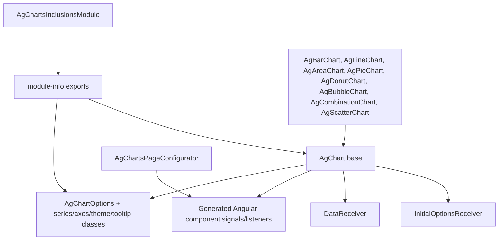

# C4 — Component (AgCharts Runtime)

- `AgChart<J>` base (`src/main/java/com/jwebmp/plugins/agcharts/AgChart.java`)
  - Generates Angular component fields/signals and websocket listener wiring (`initializeOptionsListener`, `initializeDataListener`, `fetchOptions`, `fetchDataChannel`).
  - Registers receivers with `IGuicedWebSocket` for per-component listener names.
- Receivers
  - `InitialOptionsReceiver` → invokes `getInitialOptions()` and adds data to `AjaxResponse`.
  - `DataReceiver` → invokes `getInitialData()` (wrapped in `DynamicData`) to push series data.
- Concrete charts
  - `AgBarChart`, `AgLineChart`, `AgAreaChart`, `AgPieChart`, `AgDonutChart`, `AgBubbleChart`, `AgCombinationChart`, `AgScatterChart` supply default series/options using CRTP setters.
- Configuration
  - `AgChartsPageConfigurator` declares npm deps (`ag-charts-community`, `ag-charts-enterprise`, `ag-charts-angular`, `ag-charts-locale`) for Angular bundling.
  - `AgChartsInclusionsModule` exposes module scan package for Guice.
- Option model
  - `AgChartOptions` aggregates axes (`options/axes/*`), legend/tooltip (`options/legend/*`, `options/tooltip/*`), theme (`options/theme/*`), locale/background/padding, series (`options/series/*`), overlays, navigator, gradient legend.

