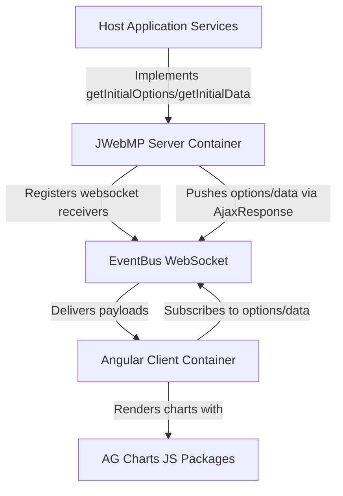

# C4 — Container

- JWebMP Server Container  
  - Hosts `AgChart` subclasses and websocket receivers (`InitialOptionsReceiver`, `DataReceiver`) registered through `IGuicedWebSocket`.  
  - Uses Guice (`AgChartsInclusionsModule`) to expose module/package scanning.  
  - Generates Angular artifacts from annotations (`@NgField`, `@NgMethod`, `@NgAfterViewInit`) and serves Mutiny-based options/data via `AjaxResponse`.
- Angular Client Container  
  - Angular 20 runtime produced by JWebMP build; contains generated AgChart component signals and subscriptions.  
  - Talks to server through EventBusService over websockets; renders AG Charts via `ag-charts-angular`.
- AG Charts JS Packages  
  - `ag-charts-community` plus optional `ag-charts-enterprise`, `ag-charts-angular`, `ag-charts-locale` declared in `AgChartsPageConfigurator`.
- Host Application Services  
  - Supply actual chart data/options by overriding `getInitialOptions()`/`getInitialData()` in concrete chart components.

