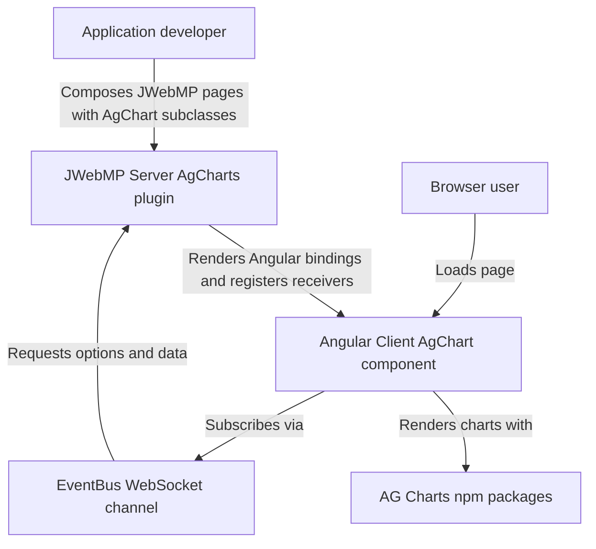

# C4 — Context

- System: AgCharts JWebMP plugin delivering AG Charts via Angular 20 in JWebMP pages.
- Users: application developers embedding charts; end users viewing charts in the browser.
- External dependencies: AG Charts npm packages (`ag-charts-angular`, `ag-charts-community`), JWebMP/GuicedEE runtime, EventBus/WebSocket channel provided by JWebMP core.
- Trust boundaries: browser ↔ websocket, server-side Guice context ↔ injected chart instances; enterprise AG Charts features depend on host licensing.

