# ERD — Chart Option Model

- Scope: AG Charts 12.2.0 option objects (all 38 top-level chart options + nested configurations).
- Relationships align with `ag-charts-types@12.2.0` chart/series option definitions; keep wrapper classes in `options/**` in sync.
- **Status: Complete — All 38 AG Charts 12.2.0 options implemented as of December 2, 2025.**

```mermaid
erDiagram
  AgChartOptions ||--o{ AgAxisBaseOptions : axes
  AgChartOptions ||--o{ AgSeriesBaseOptions : series
  AgChartOptions ||--|| AgChartLegendOptions : legend
  AgChartOptions ||--|| AgChartTooltipOptions : tooltip
  AgChartOptions ||--|| AgLocaleOptions : locale
  AgChartOptions ||--|| AgChartBackground : background
  AgChartOptions ||--|| AgChartTheme : theme
  AgChartOptions ||--|| AgSeriesAreaOptions : seriesArea
  AgChartOptions ||--|| AgChartOverlaysOptions : overlays
  AgChartOptions ||--|| AgNavigatorOptions : navigator
  AgChartOptions ||--|| AgGradientLegendOptions : gradientLegend

  %% NEW in December 2025: All 23 missing AG Charts 12.2.0 options
  AgChartOptions ||--|| AgChartHighlightOptions : highlight
  AgChartOptions ||--|| AgChartAnimationOptions : animation
  AgChartOptions ||--|| AgChartZoomOptions : zoom
  AgChartOptions ||--|| AgChartRangesOptions : ranges
  AgChartOptions ||--|| AgChartSyncOptions : sync
  AgChartOptions ||--|| AgChartContextMenuOptions : contextMenu
  AgChartOptions ||--|| AgChartDataSourceOptions : dataSource
  AgChartOptions ||--|| AgChartKeyboardOptions : keyboard
  AgChartOptions ||--|| AgChartTouchOptions : touch
  AgChartOptions ||--|| AgChartListenersOptions : listeners
  AgChartOptions ||--|| AgChartFormatterOptions : formatter
  AgChartOptions ||--|| AgChartContainerOptions : container
  AgChartOptions ||--|| AgChartDataOptions : data
  AgChartOptions ||--|| AgChartAnnotationsOptions : annotations
  AgChartOptions ||--|| AgChartInitialStateOptions : initialState
  AgChartOptions ||--|| AgChartMiscOptions : misc

  %% Highlight detail
  AgChartHighlightOptions ||--|| AgChartHighlightStyleOptions : highlightedItem
  AgChartHighlightOptions ||--|| AgChartHighlightStyleOptions : unhighlightedItem
  AgChartHighlightOptions ||--|| AgChartHighlightStyleOptions : highlightedSeries
  AgChartHighlightOptions ||--|| AgChartHighlightStyleOptions : unhighlightedSeries

  %% Series relationships
  AgSeriesBaseOptions ||--|| AgSeriesLabelOptions : label
  AgSeriesBaseOptions ||--|| AgSeriesMarkerOptions : marker
  AgSeriesBaseOptions ||--|| AgSeriesTooltipOptions : tooltip
  AgSeriesBaseOptions ||--|| AgSeriesSegmentationOptions : segmentation
  AgSeriesBaseOptions ||--|| AgSeriesHighlightOptions : highlight

  AgSeriesBaseOptions ||--o{ AgGradientColor : gradientFill
  AgSeriesBaseOptions ||--o{ AgPatternFill : patternFill
  AgSeriesBaseOptions ||--o{ AgImageFill : imageFill
```

## Implementation Status

| Category | Count | Status |
|----------|-------|--------|
| **Chart Options** | 38 | ✅ Complete |
| **Option Classes** | 127 | ✅ Complete |
| **Package Exports** | 27 | ✅ Complete |
| **CRTP Setters** | All | ✅ Complete |
| **Jackson Support** | All | ✅ Complete |
| **Deprecated Items** | 0 | ✅ Removed |

## Notes

- **Fill types** can be raw color string (`setFill(String)`) or object types (Gradient, Pattern, Image); ERD focuses on object relations.
- **Chart-level 12.2 options** (added December 2025): highlight, animation, zoom, ranges, sync, contextMenu, dataSource, keyboard, touch, listeners, formatter, container, data, annotations, initialState, misc.
- **Deprecated items removed** in 12.2.0 alignment: `highlightStyle` in series (use series-level `highlight`), global formatter options (use `AgChartFormatterOptions`), `seriesId` (use `id`).
- **Axis subtypes**: NumberAxis, TimeAxis, CategoryAxis, LogAxis, OrdinalTimeAxis, UnitTimeAxis, GroupedCategoryAxis — all extend `AgAxisBaseOptions`.
- **Series types**: Bar, Line, Area, Pie, Donut, Bubble, Scatter — all extend `AgSeriesBaseOptions`.
- **Enterprise-only options**: `navigator`, `gradientLegend`, and some `sync` modes require `ag-charts-enterprise`.
- Additional axis/legend/series subclasses inherit from the exported packages; extend this diagram if new relations are introduced.
