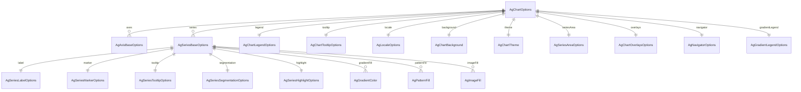

# ERD — Chart Option Model

- Scope: configuration objects wired in `AgChartOptions` and `AgSeriesBaseOptions` (no persistence layer present).
- Relationships derived from fields in `options/AgChartOptions.java` and `options/series/AgSeriesBaseOptions.java`.

Notes
- Fill can also be a raw color string (`setFill(String)`), but ERD focuses on object relations.
- Additional axes/legend subclasses inherit from the exported packages; extend this diagram if new relations are introduced.
