# ERD — Chart Option Model

- Scope: AG Charts 12.2 option objects (no persistence layer present).
- Relationships align with `ag-charts-types@12.2.0` chart/series option definitions; keep wrapper classes in `options/**` in sync.

```mermaid
erDiagram
  AgChartOptions ||--o{ AgAxisBaseOptions : axes
  AgChartOptions ||--o{ AgSeriesBaseOptions : series
  AgChartOptions ||--|| AgChartLegendOptions : legend
  AgChartOptions ||--|| AgChartTooltipOptions : tooltip
  AgChartOptions ||--|| AgLocaleOptions : locale
  AgChartOptions ||--|| AgChartBackground : background
  AgChartOptions ||--|| AgChartTheme : theme
  AgChartOptions ||--|| AgSeriesAreaOptions : seriesArea
  AgChartOptions ||--|| AgChartOverlaysOptions : overlays
  AgChartOptions ||--|| AgNavigatorOptions : navigator
  AgChartOptions ||--|| AgGradientLegendOptions : gradientLegend
  AgChartOptions ||--|| AgChartHighlightOptions : highlight
  AgChartOptions ||--|| AgChartZoomOptions : zoom
  AgChartOptions ||--|| AgChartSyncOptions : sync
  AgChartOptions ||--|| AgChartRangesOptions : ranges
  AgChartOptions ||--|| AgChartContextMenuOptions : contextMenu
  AgChartOptions ||--|| AgChartDataSourceOptions : dataSource
  AgChartOptions ||--|| AgChartAnimationOptions : animation
  AgChartOptions ||--|| FormatterConfiguration : formatter
  AgChartOptions ||--|| AgChartKeyboardOptions : keyboard
  AgChartOptions ||--|| AgChartTouchOptions : touch

  AgSeriesBaseOptions ||--|| AgChartLabelOptions : label
  AgSeriesBaseOptions ||--|| AgSeriesMarkerOptions : marker
  AgSeriesBaseOptions ||--|| AgSeriesTooltipOptions : tooltip
  AgSeriesBaseOptions ||--|| AgSeriesSegmentationOptions : segmentation
  AgSeriesBaseOptions ||--|| AgSeriesHighlightOptions : highlight

  AgSeriesBaseOptions ||--o{ AgGradientColor : gradientFill
  AgSeriesBaseOptions ||--o{ AgPatternFill : patternFill
  AgSeriesBaseOptions ||--o{ AgImageFill : imageFill
```

Notes
- Fill can also be a raw color string (`setFill(String)`); ERD focuses on object relations.
- Chart-level additions in 12.2: highlight/sync/zoom/ranges/contextMenu/dataSource/animation plus keyboard/touch input toggles and the new formatter configuration.
- Deprecated in 12.2: `highlightStyle` in series (use `highlight`) and `AgSeriesAreaPaddingOptions` (use `Padding`/`PaddingOptions`).
- Additional axis/legend subclasses inherit from the exported packages; extend this diagram if new relations are introduced.
