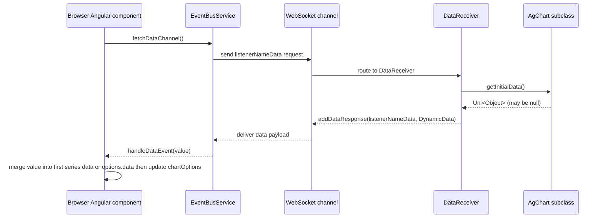

# Sequence — Data Fetch and Update

Notes
- Subsequent server pushes can reuse the same listener to stream updates; handler keeps existing options and overlays new data.
- Errors during parsing are logged on the client; no retry/backoff is currently coded.
