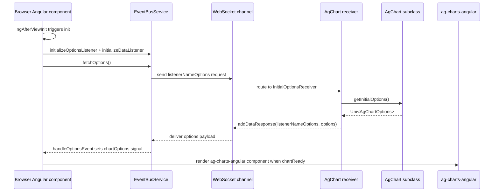

# Sequence — Initial Chart Load

Flow based on `AgChart` lifecycle and websocket receivers.

Notes
- Listener names derive from `DivSimple` id: `<id>Options` / `<id>Data`.
- Options payload may be raw object or wrapped in `{ out: [...] }`; handler normalizes before setting `chartOptions`.
